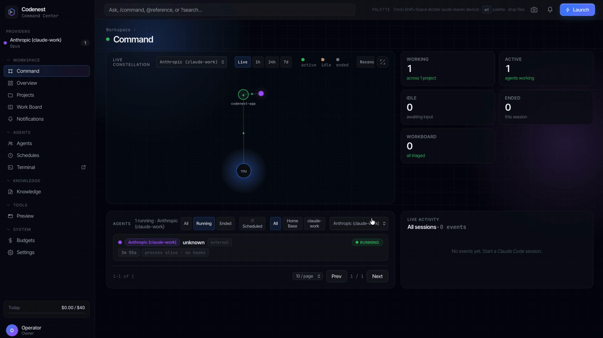

# Codenest

A cross-platform desktop command center for running and supervising AI agent
teams — built and tested on macOS first.

[](https://github.com/MykhailoNester/codenest-app/releases)
[](https://github.com/MykhailoNester/codenest-app/releases)
-black)
[](LICENSE)
[](https://github.com/MykhailoNester/codenest-app/actions)

<!-- hero demo GIF: docs/media/hero.gif -->
<!-- <p align="center"></p> -->

## What is Codenest

Codenest is a local-first desktop app for running and supervising teams of
AI coding agents. It hosts embedded terminals that run real Claude Code CLI
sessions, tracks their work on a kanban Work Board, and runs agents on cron
Schedules — all from a single window, with every bit of state kept in a local
SQLite database on your machine.

It is built on a cross-platform stack (Tauri 2, a Python sidecar, and a React
frontend) intended for macOS, Windows, and Linux. Today it is built and tested
on **macOS (Apple Silicon)** — the only supported platform for now; other
platforms are on the roadmap.

## Download

Grab the latest macOS (Apple Silicon) `.dmg` from the
[Releases page](https://github.com/MykhailoNester/codenest-app/releases). Builds for
other platforms will be added there as they are tested.

1. Open the `.dmg` and drag **Codenest.app** into `/Applications`.
2. Releases are unsigned, so clear the quarantine attribute:

   ```bash
   xattr -cr /Applications/Codenest.app
   ```

3. On first launch, if macOS blocks the app: **macOS 15+** open **System
   Settings → Privacy & Security** and click **Open Anyway**; on older macOS,
   right-click the app and choose **Open**.

See [docs/install.md](docs/install.md) for the full walkthrough, where data
lives, and how to reset the app.

## Features

Codenest's sidebar is organized into groups. The features below ship today and
are visible by default; individual features can be toggled under
**Settings → Features**.

**Workspace**

- **Command** — the Command Center: launch and supervise agent runs.
- **Overview** — a dashboard of current activity and status.
- **Projects** — the repositories and workspaces your agents work in.
- **Work Board** — a kanban board of tasks and workflow items.
- **Notifications** — in-app alerts.

**Agents**

- **Agents** — your team of agent definitions.
- **Schedules** — cron-scheduled agent runs.
- **Terminal** — embedded xterm.js terminals backed by real PTYs.

**Knowledge**

- **Knowledge** — a document library.

**Tools**

- **Preview** — an embedded webview preview pane.

**System**

- **Budgets** — usage and cost budgets.
- **Settings** — app and feature configuration.

### Planned (not yet available)

These are placeholders for features we intend to build. They are **disabled by
default and hidden from the sidebar** until they are ready — the details below
are provisional and may change:

- **Snippets** — a snippet library.
- **Gallery** — a gallery of reusable items.
- **Feed** — an activity feed.
- **MCP** — manage MCP (Model Context Protocol) servers.
- **Integrations** — external integrations.
- **Plugins** — plugin management.
- **Sync** — synchronization settings.

<!-- screenshot: docs/media/command-center.png -->
<!-- screenshot: docs/media/work-board.png -->
<!-- screenshot: docs/media/terminal.png -->

## How it works

A Tauri 2 (Rust) shell is the process supervisor. On launch it spawns a FastAPI
(Python) sidecar that owns all application state in SQLite and serves it on
`127.0.0.1:8002`, then waits for the sidecar's health check before showing the
UI. The React/TypeScript frontend talks to the sidecar over HTTP/SSE and uses
Tauri `invoke` for shell-level work — PTY-backed xterm.js terminals, windows,
the preview webview, and screenshots. Agent process spawning lives in the Rust
shell; the sidecar queues due scheduled runs and the shell dispatches them.
Everything runs on your machine: the sidecar is loopback-only and the app sends
no telemetry.

## Build from source

Prerequisites:

- macOS (Apple Silicon) — the only platform tested so far
- Xcode Command Line Tools
- Rust (stable, 1.88+)
- Node 20+ with [pnpm](https://pnpm.io/)
- Python 3.12

```bash
python3 -m venv .venv && .venv/bin/pip install -r requirements.txt
pnpm install
pnpm tauri:dev     # sidecar archive auto-builds via the Tauri beforeDevCommand hook
pnpm tauri:build   # production .app + DMG
```

The Python sidecar is packaged into an archive by `scripts/build-sidecar.sh`.
You do not need to run it by hand: `pnpm tauri:dev` builds it on first run if
missing, and `pnpm tauri:build` always rebuilds it. To prebuild it manually, run
`bash scripts/build-sidecar.sh`.

## Contributing

Contributions are welcome — see [CONTRIBUTING.md](CONTRIBUTING.md) for setup, the
`make check-all` gate, and project conventions.

## License

Codenest is licensed under the [Functional Source License, Version 1.1, ALv2
Future License](LICENSE) (`FSL-1.1-ALv2`) — a source-available license. You
may use, copy, modify, and redistribute the source for any purpose **except a
competing commercial use**. Two years after each version is released, that
version automatically converts to the Apache License 2.0.

See [NOTICE](NOTICE) for attribution and
[THIRD-PARTY-NOTICES.md](THIRD-PARTY-NOTICES.md) for bundled third-party
dependencies.
