# Codenest

A cross-platform desktop command center for running and supervising AI agent
teams — built and tested on macOS first.

[](https://github.com/MykhailoNester/codenest-app/releases)
[](https://github.com/MykhailoNester/codenest-app/releases)
-black)
[](LICENSE)
[](https://github.com/MykhailoNester/codenest-app/actions/workflows/ci.yml)

<p align="center">
  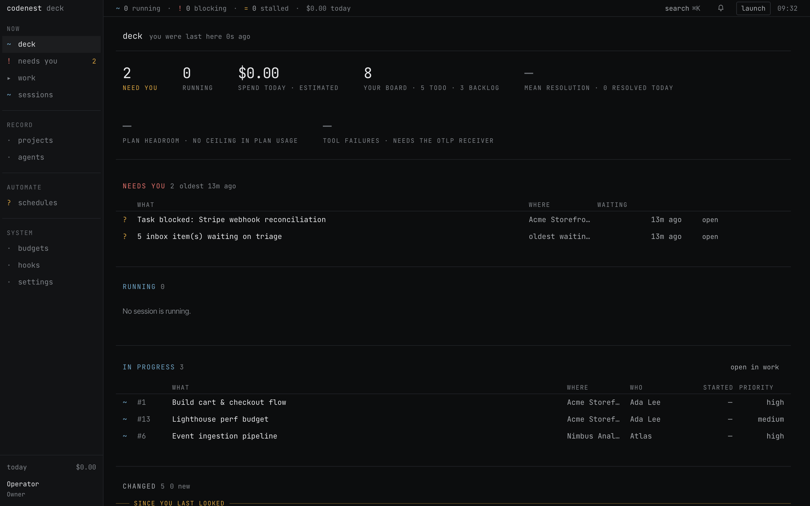
</p>

## What is Codenest

Codenest is a local-first desktop app for running and supervising teams of
AI coding agents. It hosts embedded terminals that run real Claude Code CLI
sessions, tracks their work on a Work board, and runs agents on cron
Schedules — all from a single window, with every bit of state kept in a local
SQLite database on your machine.

It is built on a cross-platform stack (Tauri 2, a Python sidecar, and a React
frontend) intended for macOS, Windows, and Linux. Today it is built and tested
on **macOS (Apple Silicon)** — the only supported platform for now; other
platforms are on the roadmap.

## Download

Grab the latest macOS (Apple Silicon) `.dmg` from the
[Releases page](https://github.com/MykhailoNester/codenest-app/releases). Builds for
other platforms will be added there as they are tested.

1. Open the `.dmg` and drag **Codenest.app** into `/Applications`.
2. Releases are unsigned, so clear the quarantine attribute:

   ```bash
   xattr -cr /Applications/Codenest.app
   ```

3. On first launch, if macOS blocks the app: **macOS 15+** open **System
   Settings → Privacy & Security** and click **Open Anyway**; on older macOS,
   right-click the app and choose **Open**.

See [docs/install.md](docs/install.md) for the full walkthrough, where data
lives, and how to reset the app.

## Features

Codenest's rail is organised into four groups. Needs You, Work, Schedules,
Budgets and Hooks can each be switched off under **Settings → Features**.

**Now**

- **Deck** — the home screen: what needs you, what is running, what it is
  costing today, and what changed since you last looked.
- **Needs You** — the intervention queue: stalled sessions, failed scheduled
  runs, budget thresholds, blocked tasks and unread notifications in one list.
  Every row offers the one action that gets you to the problem — focus the live
  pane, open the session, start one seeded from the ticket, or jump to the
  surface that owns it.
- **Work** — tasks grouped by status, with a detail page carrying subtasks,
  comments, blockers, activity, agent runs and what the task has cost.
- **Sessions** — two halves of one surface: **panes**, where a session runs
  (native agent panes and PTY-backed xterm.js terminals), and **runs**, where
  every run is listed, filtered, focused, stopped and inspected.

**Record**

- **Projects** — the repositories your agents work in, each with a context
  panel showing what ran there and what it cost.
- **Agents** — your team of agent definitions, and what each has been invoked
  for.

**Automate**

- **Schedules** — cron- and event-triggered agent runs, with their run history
  and transcripts.

**System**

- **Budgets** — usage and cost budgets by workspace or project.
- **Hooks** — what is on each Claude Code hook event, and which of the eight
  possible sources put it there.
- **Settings** — app, provider, profile and feature configuration.

## Screenshots

**Needs You** — the intervention queue. Each row names what is wrong, where it
is, how long it has waited, and offers the single action that takes you there.

<p align="center">
  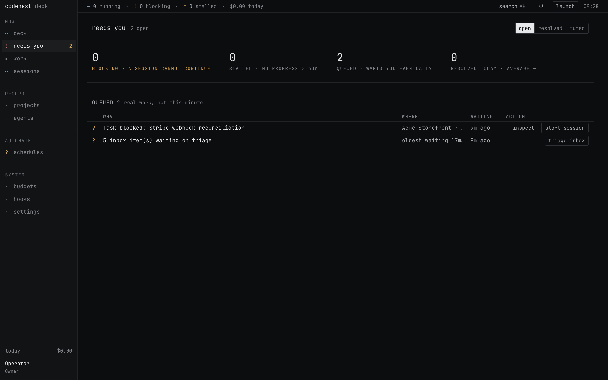
</p>

**Sessions → runs** — every agent run in one list, with its provider, project,
model, current tool, elapsed time and cost, plus a live activity feed. Focus
jumps straight to the pane the run is in; it is the same page.

<p align="center">
  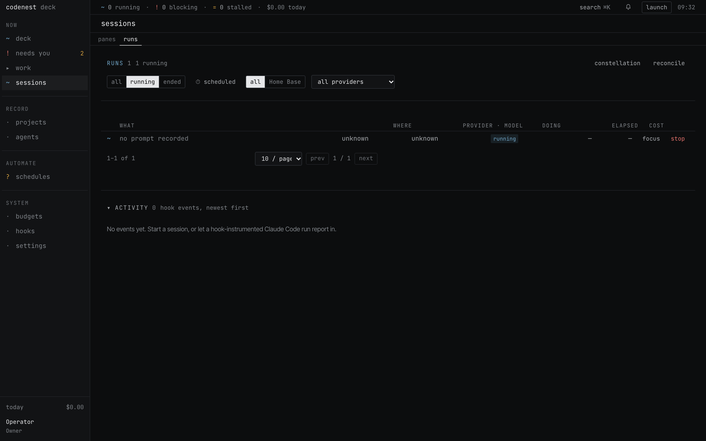
</p>

**Work** — tasks grouped by status, filterable by project and assignee.

<p align="center">
  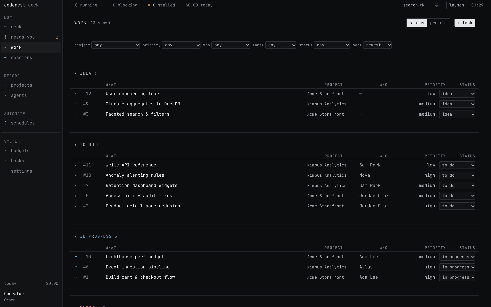
</p>

**Launch a session** — pick a recipe or a saved preset, then edit an ordered
list of agent and shell panes, each with its own provider, model and permission
mode. One shared prompt feeds every agent pane that opts in; choose a project,
profile and target, then launch or save the composition as a preset.

<p align="center">
  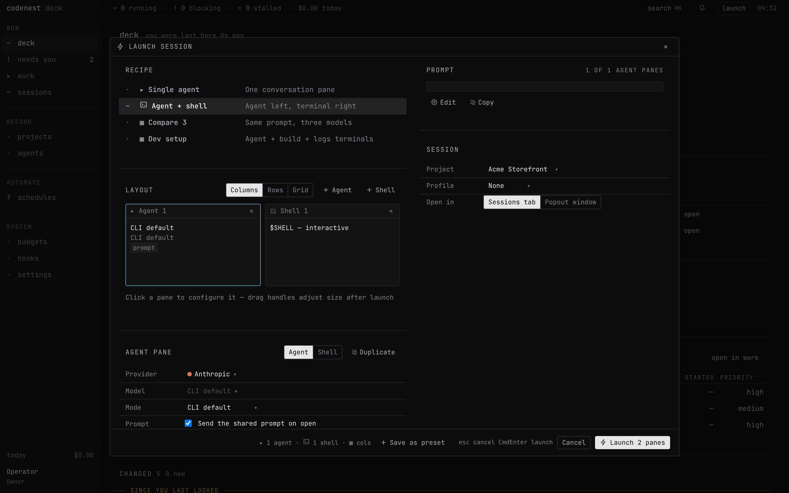
</p>

<details>
<summary>More screenshots — Projects, Agents, Schedules, Budgets, Settings, first run</summary>

<br>

**Projects** — the repositories your agents work in. Imported projects stay
read-only sources; nothing is ever written into their folders.

<p align="center">
  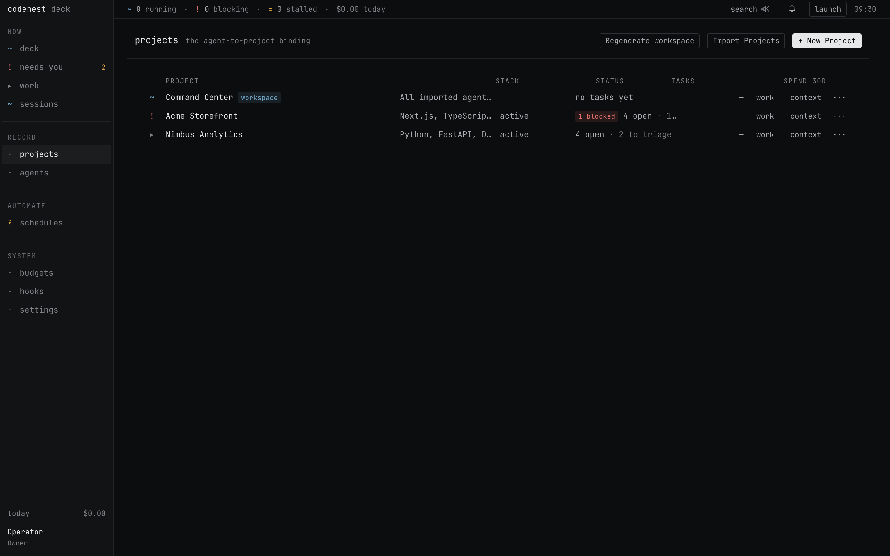
</p>

**Agents** — your team of agent definitions, grouped by scope. Codenest ships
with three org agents (Atlas, Orion, Vega) shared across the workspace.

<p align="center">
  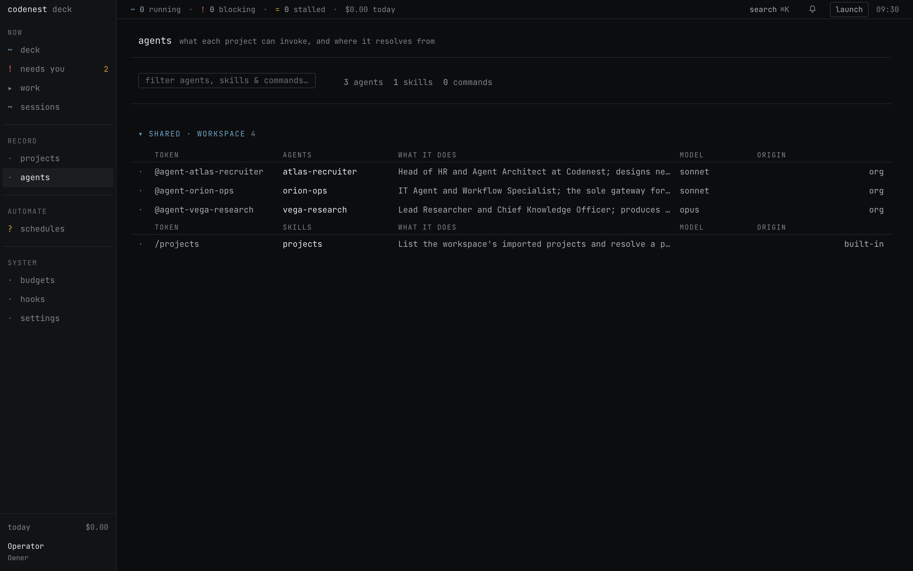
</p>

**Schedules** — cron- and event-triggered runs, with their history and
transcripts.

<p align="center">
  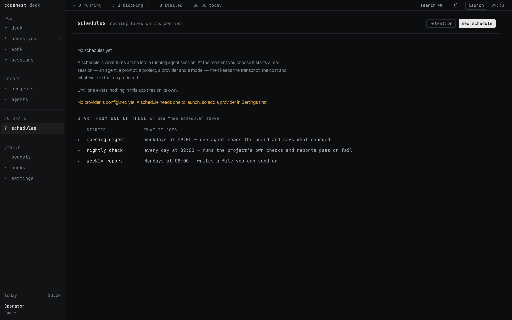
</p>

**Budgets** — per-workspace or per-project spend caps by period, with an
optional hard stop that blocks new sessions at 100%.

<p align="center">
  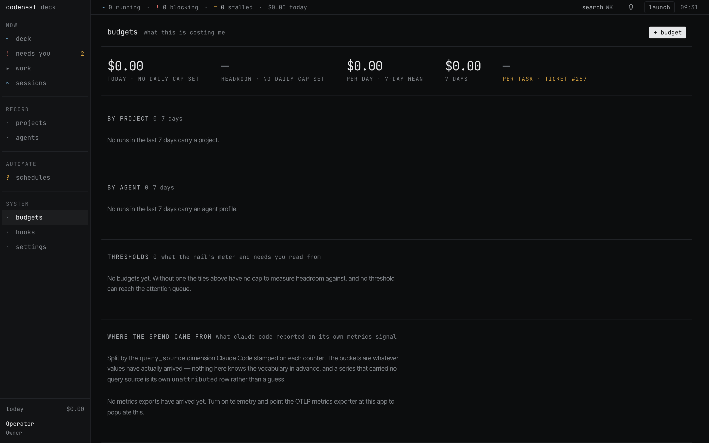
</p>

**Settings** — providers, profiles, workflow vocabulary, terminal, telemetry
and the feature toggles.

<p align="center">
  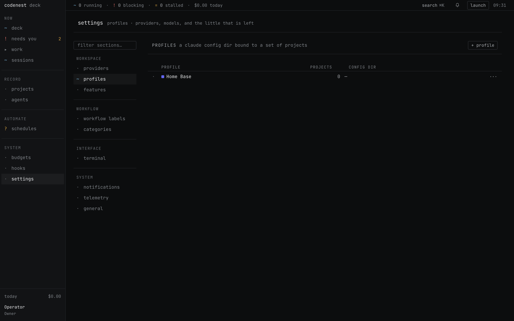
</p>

**First-run setup** — a seven-step wizard that creates the app-managed
workspace, imports your projects and connects your AI provider.

<p align="center">
  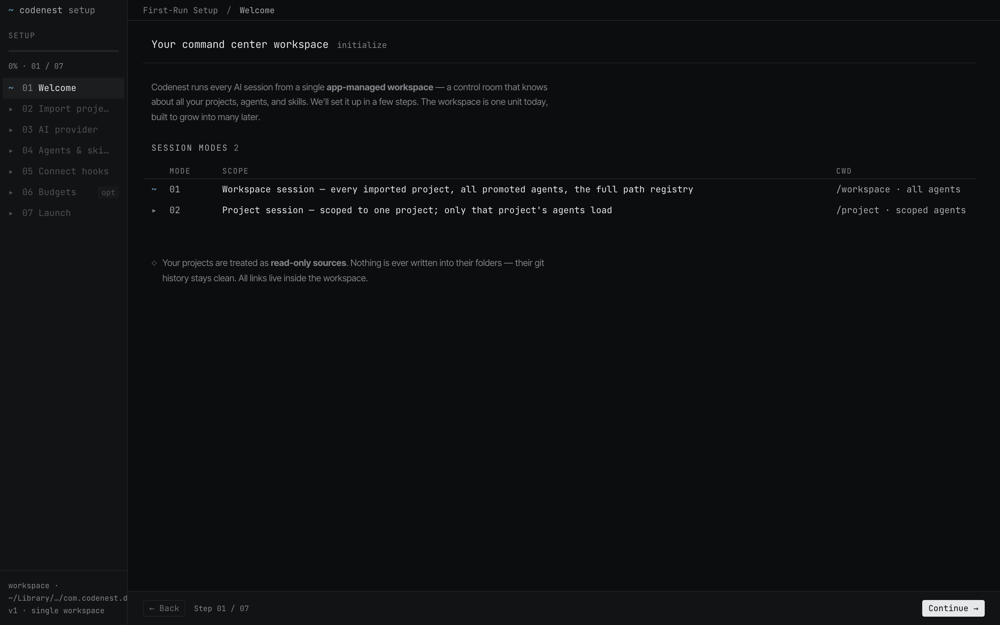
</p>

</details>

## How it works

A Tauri 2 (Rust) shell is the process supervisor. On launch it spawns a FastAPI
(Python) sidecar that owns all application state in SQLite and serves it on
`127.0.0.1:8002`, then waits for the sidecar's health check before showing the
UI. The React/TypeScript frontend talks to the sidecar over HTTP/SSE and uses
Tauri `invoke` for shell-level work — PTY-backed xterm.js terminals, windows,
the filesystem watcher and git. Agent process spawning lives in the Rust
shell; the sidecar queues due scheduled runs and the shell dispatches them.
Everything runs on your machine: the sidecar is loopback-only and the app sends
no telemetry.

## Build from source

Prerequisites:

- macOS (Apple Silicon) — the only platform tested so far
- Xcode Command Line Tools
- Rust (stable, 1.88+)
- Node 20+ with [pnpm](https://pnpm.io/)
- Python 3.12

```bash
python3 -m venv .venv && .venv/bin/pip install -r requirements.txt
pnpm install
pnpm tauri:dev     # sidecar archive auto-builds via the Tauri beforeDevCommand hook
pnpm tauri:build   # production .app + DMG
```

The Python sidecar is packaged into an archive by `scripts/build-sidecar.sh`.
You do not need to run it by hand: `pnpm tauri:dev` builds it on first run if
missing, and `pnpm tauri:build` always rebuilds it. To prebuild it manually, run
`bash scripts/build-sidecar.sh`.

## Contributing

Contributions are welcome — see [CONTRIBUTING.md](CONTRIBUTING.md) for setup, the
`make check-all` gate, and project conventions.

## License

Codenest is licensed under the [Functional Source License, Version 1.1, ALv2
Future License](LICENSE) (`FSL-1.1-ALv2`) — a source-available license. You
may use, copy, modify, and redistribute the source for any purpose **except a
competing commercial use**. Two years after each version is released, that
version automatically converts to the Apache License 2.0.

See [NOTICE](NOTICE) for attribution and
[THIRD-PARTY-NOTICES.md](THIRD-PARTY-NOTICES.md) for bundled third-party
dependencies.
